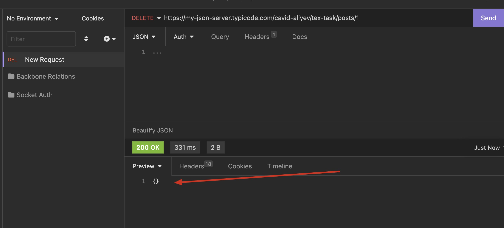

# Folder structure

```
📦src
 ┣ 📂api
 ┃ ┣ 📜comment.ts
 ┃ ┣ 📜index.ts
 ┃ ┗ 📜posts.ts
 ┣ 📂constants
 ┃ ┣ 📜index.ts
 ┃ ┣ 📜routes.ts
 ┃ ┗ 📜theme.ts
 ┣ 📂navigation
 ┃ ┗ 📜Routes.tsx
 ┣ 📂pages
 ┃ ┣ 📂PostDetail
 ┃ ┃ ┣ 📜index.tsx
 ┃ ┃ ┗ 📜styles.ts
 ┃ ┣ 📂Posts
 ┃ ┃ ┣ 📜index.tsx
 ┃ ┃ ┗ 📜styles.ts
 ┃ ┣ 📂types
 ┃ ┃ ┣ 📜comment.ts
 ┃ ┃ ┗ 📜post.ts
 ┃ ┗ 📜index.ts
 ┣ 📂store
 ┃ ┣ 📂reducers
 ┃ ┃ ┣ 📂comments
 ┃ ┃ ┃ ┣ 📜index.ts
 ┃ ┃ ┃ ┗ 📜thunk.ts
 ┃ ┃ ┗ 📂posts
 ┃ ┃ ┃ ┣ 📜index.ts
 ┃ ┃ ┃ ┗ 📜thunk.ts
 ┃ ┗ 📜index.ts
 ┗ 📂ui
 ┃ ┣ 📂Button
 ┃ ┃ ┗ 📜index.tsx
 ┃ ┣ 📂Comment
 ┃ ┃ ┗ 📜index.tsx
 ┃ ┣ 📂Header
 ┃ ┃ ┗ 📜index.tsx
 ┃ ┣ 📂Input
 ┃ ┃ ┗ 📜index.tsx
 ┃ ┣ 📂Modal
 ┃ ┃ ┗ 📜index.tsx
 ┃ ┗ 📂Post
 ┃ ┃ ┣ 📜Post.tsx
 ┃ ┃ ┗ 📜styles.ts
```

## APK file path

`android > app > build > outputs > apk > debug > app-universal-debug.apk`

> You can run apk file, simply drag and drop below apk file to the simulator

### Some Notes

There were several problems with the given server. Despite the fact that the requests sent regarding the creation and deletion of posts were successful, all posts (comments) were not updated, so it was only possible to delete (update) them from the UI.

> For exaple:


